# Skool Clone Class Diagram

This document contains the global class diagram for the current MVP.

It is based on the actual domain model in:
- [prisma/schema.prisma](/Users/jaffa/Desktop/skool/prisma/schema.prisma)

It is aligned with:
- [docs/SOFTWARE_CONCEPTION.md](/Users/jaffa/Desktop/skool/docs/SOFTWARE_CONCEPTION.md)
- [docs/SKOOL_UML_REPLACEMENT.md](/Users/jaffa/Desktop/skool/docs/SKOOL_UML_REPLACEMENT.md)

Important rule:
- this is the current MVP class diagram
- it shows the current classes and their relationships
- it is not the old LMS class model

## 1. Diagram Scope

The big class diagram includes:
- authentication classes
- profile classes
- community classes
- classroom classes
- membership and invitation classes
- post and comment classes
- evaluation and progress classes

This is the current connected domain model for the platform.

## 2. PlantUML Class Source

```plantuml
@startuml
hide circle
skinparam classAttributeIconSize 0
skinparam shadowing false
skinparam linetype ortho
skinparam packageStyle rectangle

package "Identity" {
  enum UserRole {
    MEMBER
    OWNER
    ADMIN
  }

  class User {
    +id: String
    +name: String?
    +email: String?
    +image: String?
    +passwordHash: String?
    +failedSignInAttempts: Int
    +signInLockedAt: DateTime?
    +birthDate: DateTime?
    +role: UserRole
    +createdAt: DateTime
    +updatedAt: DateTime
  }

  class UserProfile {
    +id: String
    +userId: String
    +specialty: String?
    +track: String?
    +bio: Text?
    +createdAt: DateTime
    +updatedAt: DateTime
  }

  class Account {
    +userId: String
    +type: String
    +provider: String
    +providerAccountId: String
    +refresh_token: Text?
    +access_token: Text?
    +expires_at: Int?
    +token_type: String?
    +scope: String?
    +id_token: Text?
    +session_state: String?
    +createdAt: DateTime
    +updatedAt: DateTime
  }

  class Session {
    +sessionToken: String
    +userId: String
    +expires: DateTime
    +createdAt: DateTime
    +updatedAt: DateTime
  }

  class VerificationToken {
    +identifier: String
    +token: String
    +expires: DateTime
  }
}

package "Community Core" {
  enum CommunityStatus {
    DRAFT
    PUBLISHED
    ARCHIVED
  }

  class Community {
    +id: String
    +title: String
    +slug: String
    +description: Text
    +type: String
    +status: CommunityStatus
    +ownerId: String
    +createdAt: DateTime
    +updatedAt: DateTime
  }

  class CommunityDocument {
    +id: String
    +communityId: String
    +label: String
    +url: String
    +createdAt: DateTime
    +updatedAt: DateTime
  }
}

package "Classroom" {
  class ClassroomItem {
    +id: String
    +communityId: String
    +title: String
    +content: Text
    +contentType: String
    +position: Int
    +createdAt: DateTime
    +updatedAt: DateTime
  }

  class ClassroomItemProgress {
    +id: String
    +classroomItemId: String
    +memberId: String
    +completed: Boolean
    +completedAt: DateTime?
    +lastViewedAt: DateTime?
    +createdAt: DateTime
    +updatedAt: DateTime
  }

  class CommunityEvaluation {
    +id: String
    +communityId: String
    +memberId: String
    +rating: Int
    +feedback: Text?
    +createdAt: DateTime
    +updatedAt: DateTime
  }
}

package "Access Control" {
  enum MembershipStatus {
    PENDING
    ACTIVE
    REMOVED
    REJECTED
  }

  enum InvitationStatus {
    PENDING
    ACCEPTED
    REJECTED
    CANCELLED
    EXPIRED
  }

  enum JoinRequestStatus {
    PENDING
    ACCEPTED
    REJECTED
    CANCELLED
  }

  class CommunityMembership {
    +id: String
    +communityId: String
    +memberId: String
    +status: MembershipStatus
    +joinedAt: DateTime
    +endedAt: DateTime?
  }

  class CommunityInvitation {
    +id: String
    +communityId: String
    +ownerId: String
    +memberId: String
    +status: InvitationStatus
    +sentAt: DateTime
    +respondedAt: DateTime?
  }

  class CommunityJoinRequest {
    +id: String
    +communityId: String
    +memberId: String
    +status: JoinRequestStatus
    +createdAt: DateTime
    +reviewedAt: DateTime?
    +reviewedById: String?
  }
}

package "Feed" {
  enum PostStatus {
    DRAFT
    PUBLISHED
    ARCHIVED
  }

  class CommunityPost {
    +id: String
    +communityId: String
    +authorId: String
    +title: String
    +content: Text
    +status: PostStatus
    +publishedAt: DateTime?
    +createdAt: DateTime
    +updatedAt: DateTime
  }

  class Comment {
    +id: String
    +postId: String
    +authorId: String
    +content: Text
    +createdAt: DateTime
    +updatedAt: DateTime
  }
}

User "1" -- "0..1" UserProfile : profile
User "1" -- "0..*" Account : accounts
User "1" -- "0..*" Session : sessions

User "1" -- "0..*" Community : owns
Community "1" -- "0..*" ClassroomItem : contains
Community "1" -- "0..*" CommunityDocument : resources
Community "1" -- "0..*" CommunityMembership : memberships
Community "1" -- "0..*" CommunityInvitation : invitations
Community "1" -- "0..*" CommunityJoinRequest : accessRequests
Community "1" -- "0..*" CommunityPost : posts
Community "1" -- "0..*" CommunityEvaluation : evaluations

User "1" -- "0..*" CommunityMembership : memberOf
User "1" -- "0..*" CommunityInvitation : receives
User "1" -- "0..*" CommunityInvitation : sends
User "1" -- "0..*" CommunityJoinRequest : requests
User "1" -- "0..*" CommunityJoinRequest : reviews
User "1" -- "0..*" CommunityPost : authors
User "1" -- "0..*" Comment : writes
User "1" -- "0..*" CommunityEvaluation : submits
User "1" -- "0..*" ClassroomItemProgress : tracks

ClassroomItem "1" -- "0..*" ClassroomItemProgress : progress
CommunityPost "1" -- "0..*" Comment : comments
ClassroomItemProgress }o-- ClassroomItem
ClassroomItemProgress }o-- User
CommunityMembership }o-- Community
CommunityMembership }o-- User
CommunityInvitation }o-- Community
CommunityInvitation }o-- User
CommunityJoinRequest }o-- Community
CommunityJoinRequest }o-- User
CommunityPost }o-- Community
CommunityPost }o-- User
Comment }o-- CommunityPost
Comment }o-- User
CommunityEvaluation }o-- Community
CommunityEvaluation }o-- User
CommunityDocument }o-- Community
ClassroomItem }o-- Community
UserProfile }o-- User
Account }o-- User
Session }o-- User
@enduml
```

## 3. Reading Note

This is intentionally a large connected diagram.

If a simpler presentation is needed later, it can be split into:
- identity and auth
- community access control
- classroom and progress
- feed and interaction

For the full conception deliverable, this large connected version is the correct reference.
