# Skool Clone Sequence Diagrams

This document contains actual sequence diagram source for the current MVP.

It is aligned with:
- [docs/SOFTWARE_CONCEPTION.md](/Users/jaffa/Desktop/skool/docs/SOFTWARE_CONCEPTION.md)
- [docs/SKOOL_UML_REPLACEMENT.md](/Users/jaffa/Desktop/skool/docs/SKOOL_UML_REPLACEMENT.md)

Important rule:
- these sequences describe current behavior
- they do not describe removed LMS flows
- they do not describe future Skool extensions that are not implemented yet

## 1. Sequence Set

Current MVP sequence diagrams:
- Authentication
- Registration
- Delete account
- Modify personal information
- Consult community about page
- Join free community
- Add comment
- Evaluate classroom experience
- Create community
- Invite member
- Remove member
- Consult member progress
- Consult user as admin
- Delete user as admin
- Consult community as admin
- Delete community as admin

## 2. PlantUML Sequence Source

### 2.1 Authentication

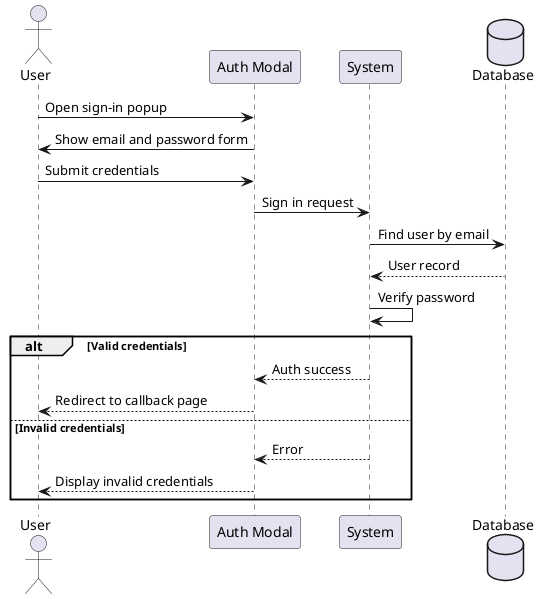

### 2.2 Registration

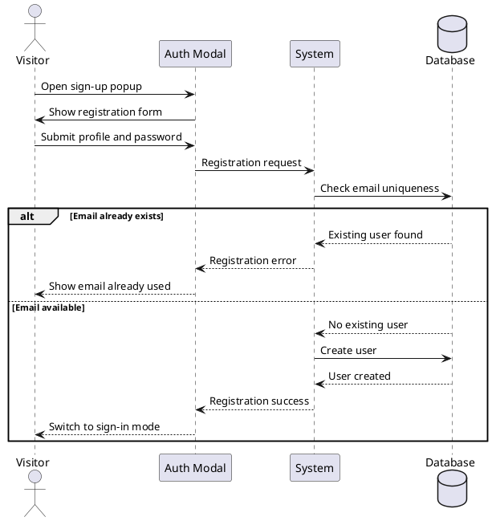

### 2.3 Delete Account

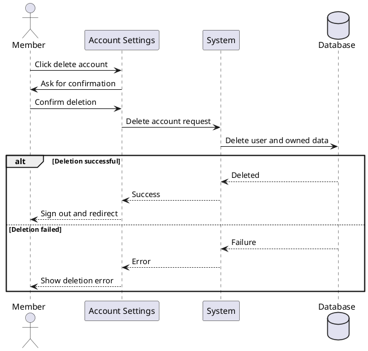

### 2.4 Modify Personal Information

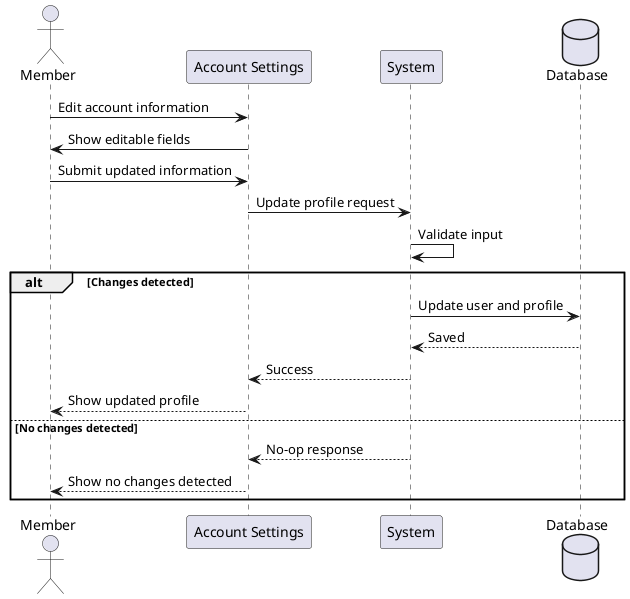

### 2.5 Consult Community About Page

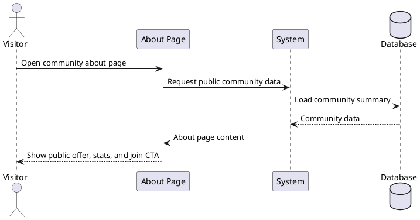

### 2.6 Join Free Community

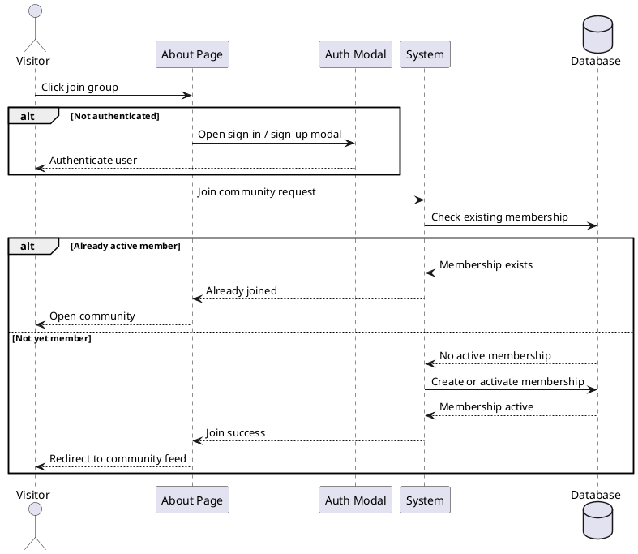

### 2.7 Add Comment

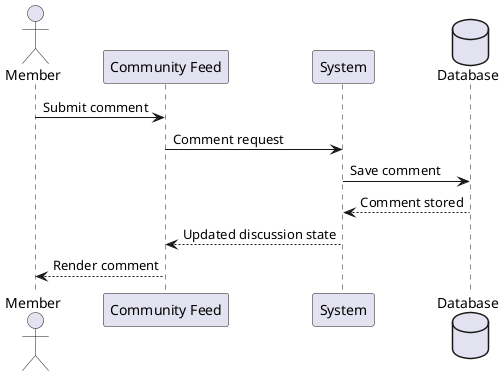

### 2.8 Evaluate Classroom Experience

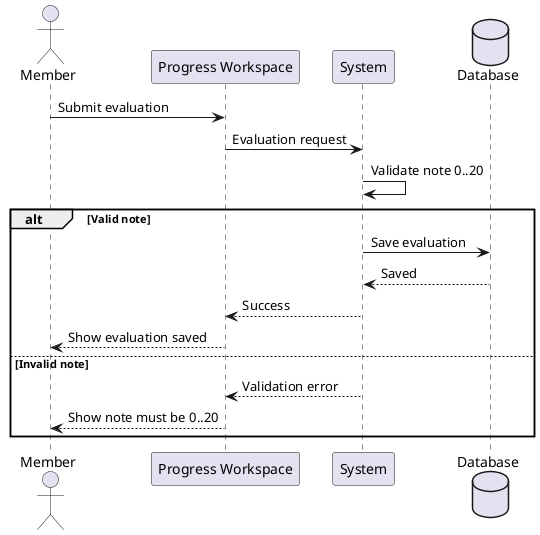

### 2.9 Create Community

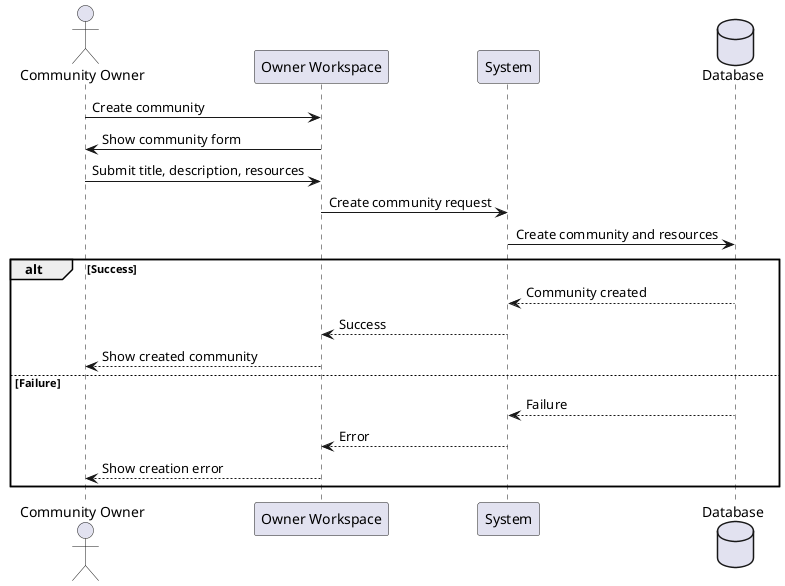

### 2.10 Invite Member

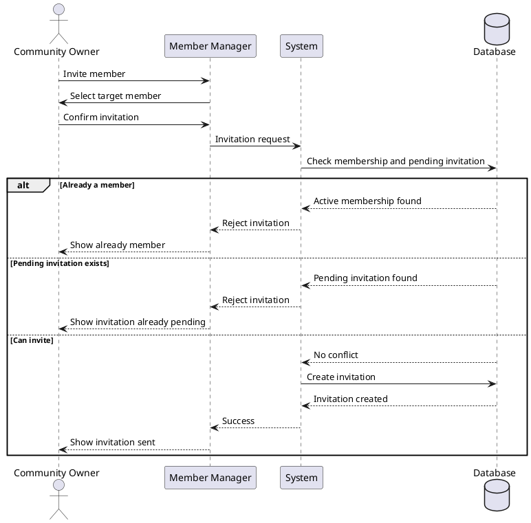

### 2.11 Remove Member

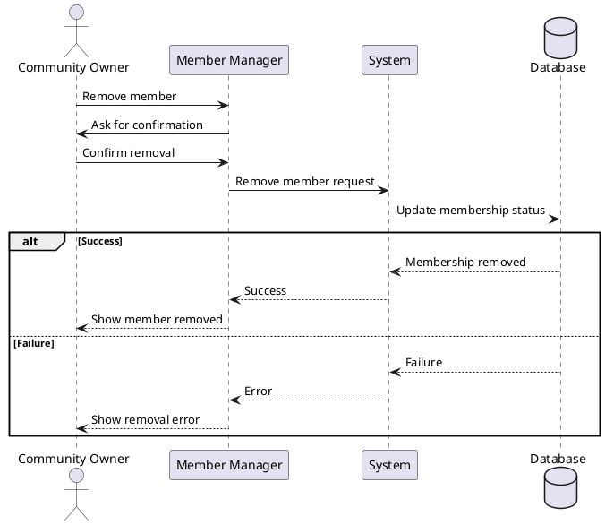

### 2.12 Consult Member Progress

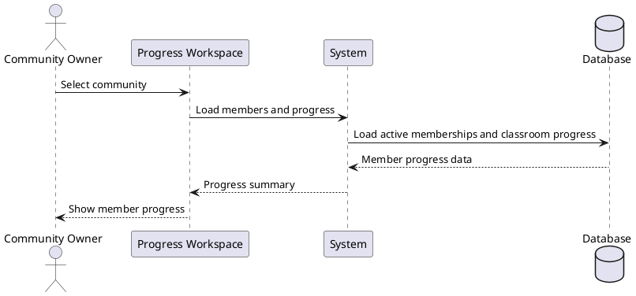

### 2.13 Consult User As Admin

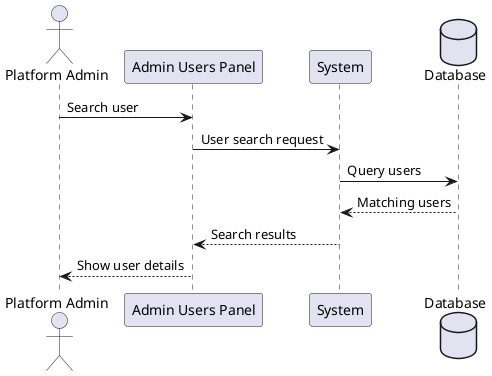

### 2.14 Delete User As Admin

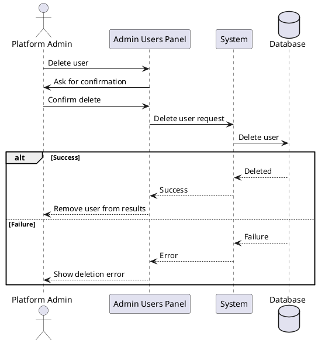

### 2.15 Consult Community As Admin

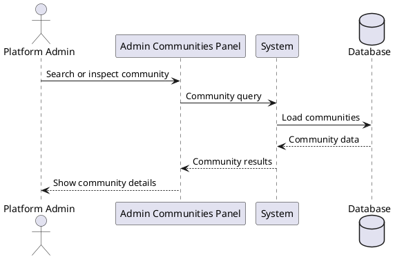

### 2.16 Delete Community As Admin

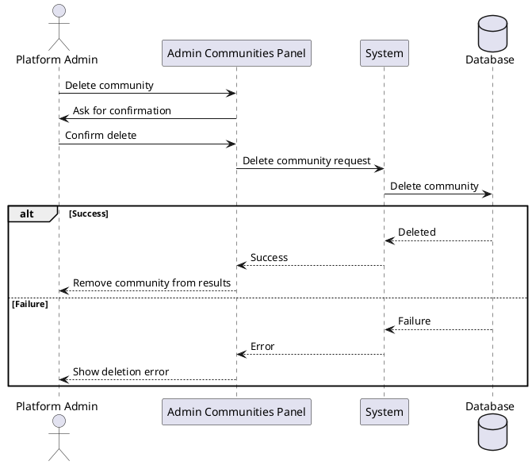
