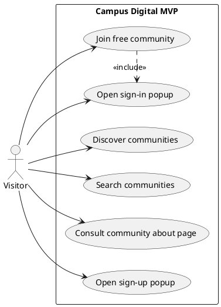
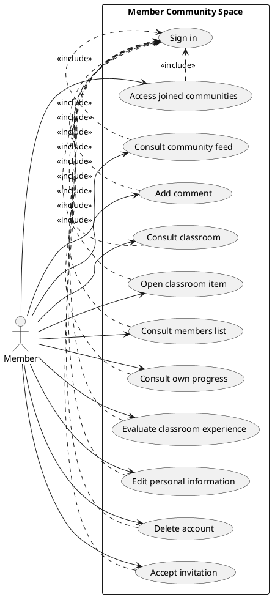
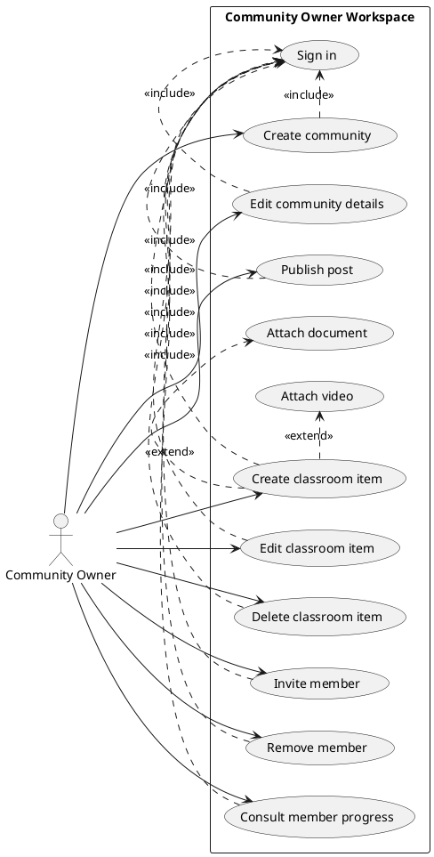
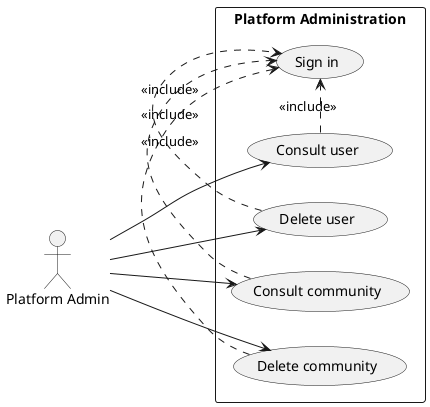

# Skool Clone UML Reference

This document is the readable UML source for the current MVP.

It covers:
- actors
- use case diagrams
- use case wording
- sequence diagram coverage
- class diagram coverage

It is aligned with [docs/SOFTWARE_CONCEPTION.md](/Users/jaffa/Desktop/skool/docs/SOFTWARE_CONCEPTION.md).

Important rule:
- this file describes the current MVP behavior
- it does not describe every future Skool feature
- if the code changes, this file should follow the code, not the other way around

## 1. Current Verdict

The old LMS-style use cases are no longer correct.

The current MVP is now centered on:
- community discovery
- public about pages
- popup authentication
- direct join for free communities
- gated member spaces
- classroom access
- posts and comments
- owner management
- platform admin governance

The main documentation correction is this:
- `Request to join a community` is no longer the default public MVP flow
- for the current implementation, free communities are joined directly after authentication
- invitation handling remains active
- owner review of join requests should not be treated as a primary MVP use case unless that flow is reintroduced in code

## 2. Actor Model

### Visitor

A non-authenticated person discovering communities.

Main goals:
- discover communities
- search communities
- consult a community about page
- open the sign-in or sign-up popup
- join a free community after authentication

### Member

An authenticated user who belongs to one or more communities.

Main goals:
- access joined communities
- consult the community feed
- add comments
- consult classroom content
- open classroom items
- consult members
- track personal progress
- evaluate the classroom experience
- manage personal account information
- accept invitations

### Community Owner

A user who owns and manages a community.

Main goals:
- create communities
- edit community details
- create and manage classroom items
- attach document and video resources
- publish posts
- invite members
- remove members
- consult member progress

### Platform Admin

A global governance role.

Main goals:
- consult users
- delete users
- consult communities
- delete communities

## 3. Readable Use Case List

### Visitor

| Use case | Status in MVP | Notes |
| --- | --- | --- |
| Discover communities | Active | Homepage and discovery cards |
| Search communities | Active | Homepage search flow |
| Consult community about page | Active | Main public conversion surface |
| Open sign-in popup | Active | Intercepted modal auth flow |
| Open sign-up popup | Active | Same modal flow, alternate mode |
| Join free community | Active | Direct join after auth |

### Member

| Use case | Status in MVP | Notes |
| --- | --- | --- |
| Access joined communities | Active | Protected and public-member flows |
| Consult community feed | Active | Community tab |
| Add comment | Active | Post and discussion interaction |
| Consult classroom | Active | Classroom tab |
| Open classroom item | Active | Full classroom item view |
| Open or download classroom resource | Active | Document and resource links |
| Consult members list | Active | Members tab |
| Consult own progress | Active | Progress workspace |
| Evaluate classroom experience | Active | `0..20` evaluation |
| Edit personal information | Active | Account settings |
| Delete account | Active | Account settings |
| Accept invitation | Active | Invitation workflow |

### Community Owner

| Use case | Status in MVP | Notes |
| --- | --- | --- |
| Create community | Active | Owner workspace |
| Edit community details | Active | Owner workspace |
| Publish post | Active | Owner posts |
| Create classroom item | Active | Owner workspace |
| Attach document resource | Active | Classroom/community resource support |
| Attach video resource | Active | Video content type support |
| Edit classroom item | Active | Owner workspace |
| Delete classroom item | Active | Owner workspace |
| Invite member | Active | Member management |
| Remove member | Active | Member management |
| Consult member progress | Active | Progress workspace |

### Platform Admin

| Use case | Status in MVP | Notes |
| --- | --- | --- |
| Consult user | Active | Admin panel |
| Delete user | Active | Admin panel |
| Consult community | Active | Admin panel |
| Delete community | Active | Admin panel |

## 4. Use Cases That Need To Be Removed From Current MVP UML

Do not keep these in the current MVP use case diagrams unless the implementation changes again:
- Request to join a community as the default public flow
- Approve join request
- Reject join request
- Calendar
- Leaderboard
- Points and levels
- Billing and recurring payments
- Moderator-only workflows

Reason:
- they are either not implemented
- or they are no longer the current primary behavior

## 5. Recommended Use Case Diagram Split

Do not build one large unreadable diagram.
Use four diagrams.

### Diagram A: Visitor

Use cases:
- Discover communities
- Search communities
- Consult community about page
- Open sign-in popup
- Open sign-up popup
- Join free community

### Diagram B: Member

Use cases:
- Access joined communities
- Consult community feed
- Add comment
- Consult classroom
- Open classroom item
- Consult members list
- Consult own progress
- Evaluate classroom experience
- Edit personal information
- Delete account
- Accept invitation

### Diagram C: Community Owner

Use cases:
- Create community
- Edit community details
- Publish post
- Create classroom item
- Attach document
- Attach video
- Edit classroom item
- Delete classroom item
- Invite member
- Remove member
- Consult member progress

### Diagram D: Platform Admin

Use cases:
- Consult user
- Delete user
- Consult community
- Delete community

## 6. PlantUML Use Case Source

### 6.1 Visitor

### 6.2 Member

### 6.3 Community Owner

### 6.4 Platform Admin

## 7. Sequence Diagram Source

Actual sequence diagram source now lives in:
- [docs/SKOOL_SEQUENCE_DIAGRAMS.md](/Users/jaffa/Desktop/skool/docs/SKOOL_SEQUENCE_DIAGRAMS.md)

Reason:
- sequence diagrams are longer
- separating them makes this file easier to read
- use cases and sequences should not be mixed into one hard-to-scan document

## 8. Class Diagram Source

Actual class diagram source now lives in:
- [docs/SKOOL_CLASS_DIAGRAM.md](/Users/jaffa/Desktop/skool/docs/SKOOL_CLASS_DIAGRAM.md)

Reason:
- the connected class diagram is large
- separating it keeps the use case document readable
- the class diagram should evolve with the actual schema and domain model

## 9. PDF Status

The old PDF is gone.

If a PDF is needed later, regenerate it from:
- [docs/SOFTWARE_CONCEPTION.md](/Users/jaffa/Desktop/skool/docs/SOFTWARE_CONCEPTION.md)
- [docs/SKOOL_UML_REPLACEMENT.md](/Users/jaffa/Desktop/skool/docs/SKOOL_UML_REPLACEMENT.md)
- [docs/SKOOL_CLASS_DIAGRAM.md](/Users/jaffa/Desktop/skool/docs/SKOOL_CLASS_DIAGRAM.md)
- [docs/SKOOL_SEQUENCE_DIAGRAMS.md](/Users/jaffa/Desktop/skool/docs/SKOOL_SEQUENCE_DIAGRAMS.md)
