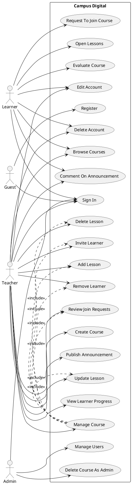
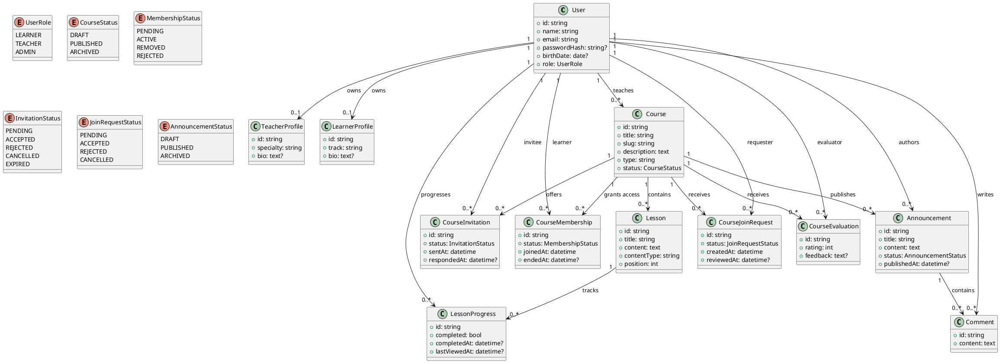
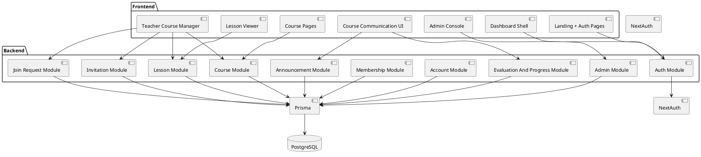
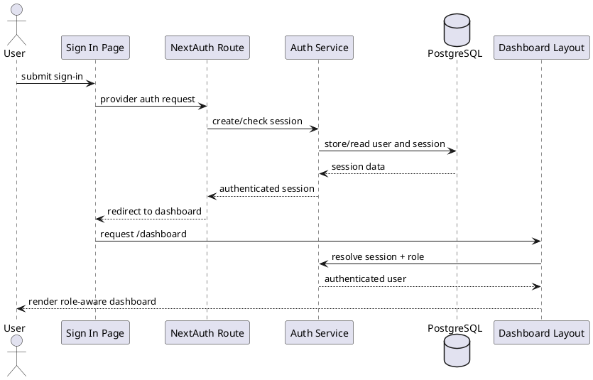
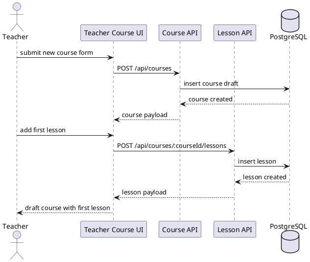
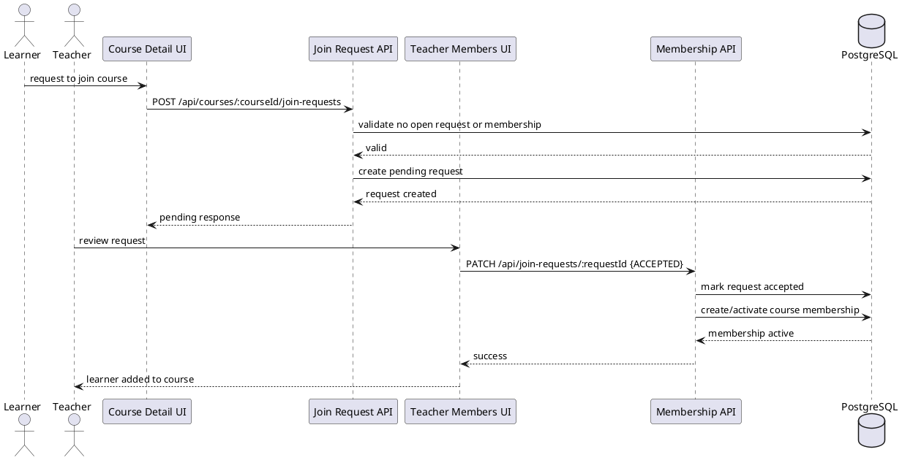
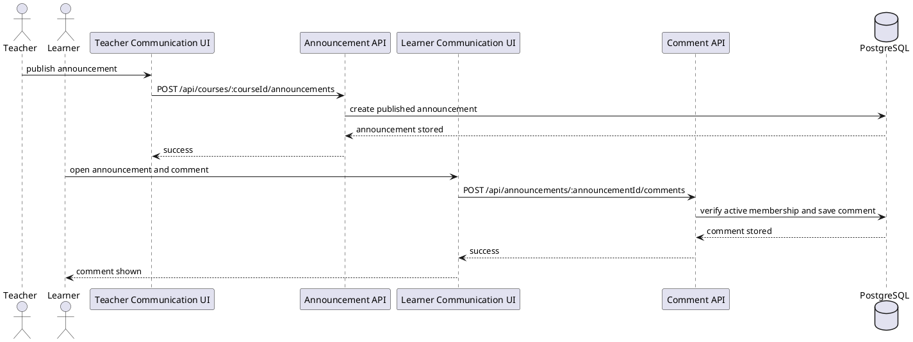
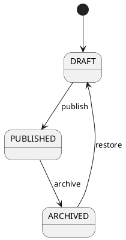
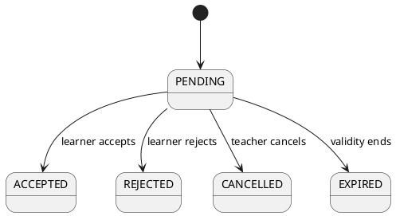
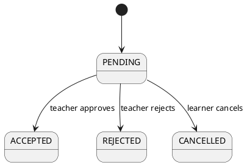

# Software Conception

Project:
- Campus Digital

Product position:
- a Skool-inspired learning platform
- adapted to the UML in `docs/Conception du projet.pdf`

Time box:
- 3 months
- 6 sprints of 2 weeks

Stack target:
- Next.js App Router
- TypeScript
- PostgreSQL
- Prisma
- NextAuth

Scope note:
- this document supersedes the earlier generic "member/community" conception where it conflicts with the new UML PDF
- the main domain is now `Admin + Teacher + Learner`
- events and leaderboard are no longer part of the core class design because they are not part of the current UML reference
- implementation should stay MVP-sized and avoid academic over-modeling

## 1. System Overview

Campus Digital is an online learning platform centered on:
- course creation and course delivery
- teacher-learner interaction
- announcements and comments around course activity
- controlled access to courses through invitations or join requests
- learner progress and course evaluation

Main product goal:
- one deployed application hosts one learning platform instance
- admins govern the platform
- teachers create and manage courses
- learners join courses, consume lessons, comment, and track progress

Architecture for the MVP:
- `Next.js` serves frontend pages and API routes
- `PostgreSQL` stores auth and product data
- `Prisma` is the schema and query layer
- `NextAuth` handles authentication and sessions

Current implementation constraint:
- the repo already has auth, protected dashboard shell, and admin scaffolding
- product domain tables beyond auth are still missing and must be added from this conception

## 2. Actors And Permissions

### Guest

Can:
- view landing page
- view sign-in page
- view public course catalog if the platform later exposes one

Cannot:
- access dashboard pages
- request to join a course
- comment
- evaluate a course

### Learner

Can:
- sign in and access learner dashboard
- view courses they are allowed to access
- request to join a course
- accept an invitation sent to them
- consume lessons
- comment on course activity
- evaluate a course after completion
- view their own progress
- edit or delete their own account

Cannot:
- create courses
- manage lessons
- publish teacher announcements
- manage other users

### Teacher

Can:
- sign in and access teacher dashboard
- create, edit, and delete their own courses
- add, update, and remove lessons in their own courses
- invite learners to a course
- accept or reject learner join requests
- remove a learner from a course
- publish announcements in their own courses
- comment in course activity
- consult learner progress for their own courses
- edit or delete their own account

Cannot:
- manage platform-wide users
- manage courses owned by other teachers unless also admin

### Admin

Can:
- do everything needed for platform governance
- manage users
- delete inappropriate or invalid courses
- view platform data needed for supervision
- override course access when required

Admin note:
- for the MVP, admin is a system-level role, not a separate user type table

## 3. Functional Modules

### Authentication And Account

Responsibilities:
- sign in
- session persistence
- role resolution
- profile edit
- account deletion

Core routes:
- `/auth/signin`
- `/dashboard`
- `/api/auth/[...nextauth]`

Implementation note:
- the current repo uses NextAuth
- the UML includes registration and password-based auth, but the repo does not implement that yet
- for MVP execution, keep the current auth base and add profile/account management before attempting a full credentials system

### Dashboard Shell

Responsibilities:
- protected layout
- shared navigation
- role-aware route visibility
- integration point for P1 and P2 work

### Course Catalog And Course Workspace

Responsibilities:
- teacher course creation and management
- learner course browsing
- course detail pages
- course ownership and access enforcement

### Lesson Management

Responsibilities:
- lesson creation, edit, delete
- lesson ordering within a course
- lesson content display for learners

### Invitations And Join Requests

Responsibilities:
- teacher sends course invitation
- learner requests to join a course
- teacher accepts or rejects requests
- teacher removes members from a course
- platform records course membership status

### Course Communication

Responsibilities:
- teacher announcements
- learner and teacher comments
- course activity history

Practical decision:
- the previous generic global feed is replaced by course-scoped communication

### Evaluation And Progress

Responsibilities:
- learner course evaluation
- learner lesson completion tracking
- teacher visibility into learner progress

### Platform Administration

Responsibilities:
- manage users
- supervise course data
- remove invalid content

### Review / Integration / Deployment

Responsibilities:
- branch review flow
- merge validation
- deploy checklist
- shared sprint gatekeeping

## 4. Business Rules

### Authentication Rules

- only authenticated users can access `/dashboard/*`
- each authenticated user has exactly one platform role: `LEARNER`, `TEACHER`, or `ADMIN`
- teacher/admin-only routes must be protected server-side, not only hidden in navigation

### Account Rules

- a user can edit only their own profile unless admin
- a user can delete only their own account unless admin
- deleting an account should be soft-delete in the data model if history retention becomes necessary; for MVP the API may begin with hard-delete and later migrate

### Course Rules

- every course belongs to one teacher owner
- a teacher can manage only courses they own unless they are admin
- a course cannot be published without a title and at least one lesson
- a learner cannot access private lesson content without an active membership

### Lesson Rules

- every lesson belongs to exactly one course
- lesson order is explicit and stable
- lessons are created and edited only by the teacher owner or admin

### Invitation And Join Rules

- a learner can have at most one active membership per course
- a learner can have at most one open join request per course
- a learner can have at most one pending invitation per course
- accepting an invitation or approving a join request creates or activates course membership
- removing a learner from a course revokes active access

### Communication Rules

- announcements belong to a course and are published by a teacher or admin
- comments belong to a course communication item
- both teachers and learners can comment if they are members of the course

Practical MVP decision:
- comments are attached to announcements first
- if a wider discussion feed is needed later, it should extend the same communication model instead of creating a second unrelated one

### Evaluation Rules

- only learners with completed or sufficiently progressed course participation can evaluate a course
- one learner can submit only one evaluation per course, with optional later editing

### Progress Rules

- learner progress is derived from lesson completion records
- course progress is a percentage based on completed lessons over total lessons
- teachers can consult learner progress only for their own courses unless admin

### Admin Rules

- admin can manage users and remove problematic course data
- admin should not become the default owner of all course operations; teacher ownership remains primary

### Sprint Scope Rules

- Sprint 01 stays foundation-only
- no optional features should enter early branches before auth, shell, schema foundation, course foundation, and course communication foundation exist

## 5. Main User Flows

### Flow A: Sign In And Enter Dashboard

1. Guest opens sign-in page.
2. User authenticates with the configured provider.
3. Session is created.
4. Dashboard shell resolves role and renders the correct entry points.

### Flow B: Teacher Creates A Course And First Lesson

1. Teacher opens course management page.
2. Teacher creates a new course draft.
3. Teacher adds the first lesson.
4. System stores course and lesson with teacher ownership.
5. Course becomes ready for invitation or publication workflow.

### Flow C: Learner Requests To Join A Course

1. Learner opens a course detail page.
2. Learner sends a join request.
3. System validates that no open request or active membership already exists.
4. Teacher reviews the request.
5. Teacher accepts or rejects it.
6. On acceptance, course membership becomes active.

### Flow D: Teacher Invites A Learner To A Course

1. Teacher opens course members area.
2. Teacher creates an invitation for a learner.
3. Learner sees the invitation.
4. Learner accepts or rejects it.
5. On acceptance, course membership becomes active.

### Flow E: Learner Follows Lessons And Evaluates Course

1. Learner opens an allowed lesson.
2. System records lesson completion or progress.
3. Progress updates at course level.
4. When course completion condition is met, learner can submit evaluation.

### Flow F: Teacher Publishes Announcement And Learners Comment

1. Teacher publishes a course announcement.
2. Course members can open the announcement.
3. Learners and teacher add comments.
4. Communication remains scoped to the course.

## 6. Database Entities And Relationships

Prisma direction:
- keep the current auth tables
- add domain tables under a single `User` model with role-based behavior
- do not model teacher and learner as separate auth tables
- use profile extensions only where the UML needs role-specific fields

### Core Enums

- `UserRole`: `LEARNER`, `TEACHER`, `ADMIN`
- `CourseStatus`: `DRAFT`, `PUBLISHED`, `ARCHIVED`
- `MembershipStatus`: `PENDING`, `ACTIVE`, `REMOVED`, `REJECTED`
- `InvitationStatus`: `PENDING`, `ACCEPTED`, `REJECTED`, `CANCELLED`, `EXPIRED`
- `JoinRequestStatus`: `PENDING`, `ACCEPTED`, `REJECTED`, `CANCELLED`
- `AnnouncementStatus`: `DRAFT`, `PUBLISHED`, `ARCHIVED`

### Entity: User

Purpose:
- system identity shared by all authenticated roles

Fields:
- `id`
- `name`
- `email`
- `image`
- `passwordHash?`
- `birthDate?`
- `role`
- `createdAt`
- `updatedAt`

Notes:
- `passwordHash` remains optional because current auth is provider-based
- if credentials auth is added later, this field becomes active

### Entity: TeacherProfile

Purpose:
- role-specific data for teachers

Fields:
- `id`
- `userId`
- `specialty`
- `bio?`

Uniqueness:
- unique `userId`

### Entity: LearnerProfile

Purpose:
- role-specific data for learners

Fields:
- `id`
- `userId`
- `track`
- `bio?`

Uniqueness:
- unique `userId`

### Entity: Course

Purpose:
- learning container owned by one teacher

Fields:
- `id`
- `title`
- `slug`
- `description`
- `type`
- `status`
- `teacherId`
- `createdAt`
- `updatedAt`

### Entity: Lesson

Purpose:
- ordered learning unit inside a course

Fields:
- `id`
- `courseId`
- `title`
- `content`
- `contentType`
- `position`
- `createdAt`
- `updatedAt`

### Entity: CourseMembership

Purpose:
- active or historical learner access to a course

Fields:
- `id`
- `courseId`
- `learnerId`
- `status`
- `joinedAt`
- `endedAt?`

Uniqueness:
- unique `(courseId, learnerId)`

### Entity: CourseInvitation

Purpose:
- teacher-initiated invitation for a learner to join a course

Fields:
- `id`
- `courseId`
- `teacherId`
- `learnerId`
- `status`
- `sentAt`
- `respondedAt?`

Constraints:
- one pending invitation per `(courseId, learnerId)`

### Entity: CourseJoinRequest

Purpose:
- learner-initiated request to join a course

Fields:
- `id`
- `courseId`
- `learnerId`
- `status`
- `createdAt`
- `reviewedAt?`
- `reviewedById?`

Constraints:
- one pending request per `(courseId, learnerId)`

### Entity: Announcement

Purpose:
- teacher/admin publication inside a course

Fields:
- `id`
- `courseId`
- `authorId`
- `title`
- `content`
- `status`
- `publishedAt?`
- `createdAt`
- `updatedAt`

### Entity: Comment

Purpose:
- responses on course communication items

Fields:
- `id`
- `announcementId`
- `authorId`
- `content`
- `createdAt`
- `updatedAt`

### Entity: CourseEvaluation

Purpose:
- learner rating and optional feedback on a course

Fields:
- `id`
- `courseId`
- `learnerId`
- `rating`
- `feedback?`
- `createdAt`
- `updatedAt`

Uniqueness:
- unique `(courseId, learnerId)`

### Entity: LessonProgress

Purpose:
- learner completion tracking at lesson level

Fields:
- `id`
- `lessonId`
- `learnerId`
- `completed`
- `completedAt?`
- `lastViewedAt?`

Uniqueness:
- unique `(lessonId, learnerId)`

### Main Relationships

- `User 1..1 -> 0..1 TeacherProfile`
- `User 1..1 -> 0..1 LearnerProfile`
- `User 1..* -> Course` as teacher owner
- `Course 1..* -> Lesson`
- `Course 1..* -> CourseMembership`
- `Course 1..* -> CourseInvitation`
- `Course 1..* -> CourseJoinRequest`
- `Course 1..* -> Announcement`
- `Course 1..* -> CourseEvaluation`
- `Announcement 1..* -> Comment`
- `Lesson 1..* -> LessonProgress`
- `Learner User 1..* -> CourseMembership`
- `Learner User 1..* -> CourseJoinRequest`
- `Learner User 1..* -> CourseInvitation`
- `Learner User 1..* -> CourseEvaluation`
- `Learner User 1..* -> LessonProgress`

### Prisma-Ready Modeling Decisions

These are the implementation decisions to keep the schema clean:
- use one `User` table with role enum, not class-table inheritance for auth identity
- use `TeacherProfile` and `LearnerProfile` as optional one-to-one extensions
- rename the previous generic `Enrollment` idea to `CourseMembership`
- keep `CourseInvitation` and `CourseJoinRequest` as separate tables because they have different ownership and lifecycle
- keep comments attached to `Announcement` first; do not add polymorphic comments in the MVP
- derive course progress in queries from `LessonProgress` instead of storing a redundant percentage column initially

## 7. API Contract Proposal

Conventions:
- JSON only
- error payload:
```json
{ "error": "message" }
```
- success payload:
```json
{ "data": {} }
```

Priority note:
- `Foundation` means relevant to current repo direction
- `Later` means valid conception target but not first implementation slice

### Auth And Account

- `GET|POST /api/auth/[...nextauth]` - Foundation
- `GET /api/me` - Foundation
- `PATCH /api/me` - Later
- `DELETE /api/me` - Later

### Courses

- `GET /api/courses` - Foundation
- `GET /api/courses/:courseId` - Foundation
- `POST /api/courses` - Later teacher/admin
- `PATCH /api/courses/:courseId` - Later teacher/admin
- `DELETE /api/courses/:courseId` - Later teacher/admin

### Lessons

- `GET /api/courses/:courseId/lessons` - Foundation
- `GET /api/lessons/:lessonId` - Foundation
- `POST /api/courses/:courseId/lessons` - Later teacher/admin
- `PATCH /api/lessons/:lessonId` - Later teacher/admin
- `DELETE /api/lessons/:lessonId` - Later teacher/admin

### Course Membership / Access

- `GET /api/courses/:courseId/members` - Later teacher/admin
- `DELETE /api/courses/:courseId/members/:learnerId` - Later teacher/admin

### Join Requests

- `POST /api/courses/:courseId/join-requests` - Later learner
- `GET /api/courses/:courseId/join-requests` - Later teacher/admin
- `PATCH /api/join-requests/:requestId` - Later teacher/admin

### Invitations

- `POST /api/courses/:courseId/invitations` - Later teacher/admin
- `GET /api/me/invitations` - Later learner
- `PATCH /api/invitations/:invitationId` - Later learner

### Announcements And Comments

- `GET /api/courses/:courseId/announcements` - Foundation direction
- `POST /api/courses/:courseId/announcements` - Later teacher/admin
- `GET /api/announcements/:announcementId/comments` - Later
- `POST /api/announcements/:announcementId/comments` - Later

### Evaluation And Progress

- `POST /api/courses/:courseId/evaluations` - Later learner
- `GET /api/courses/:courseId/evaluations` - Later teacher/admin
- `POST /api/lessons/:lessonId/progress` - Later learner
- `GET /api/courses/:courseId/progress` - Later teacher/admin

### Admin

- `GET /api/admin/users` - Later admin
- `DELETE /api/admin/users/:userId` - Later admin
- `DELETE /api/admin/courses/:courseId` - Later admin

Compatibility note:
- the current repo already has `/api/admin/courses`
- keep it temporarily, but the long-term API should move to resource-style routes

## 8. UML Diagrams

### Use Case Diagram



### Class Diagram



### Component Diagram



### Sequence Diagram: Sign In And Enter Dashboard



### Sequence Diagram: Teacher Creates Course And First Lesson



### Sequence Diagram: Learner Requests To Join And Teacher Accepts



### Sequence Diagram: Teacher Publishes Announcement And Learner Comments



### State Diagram: Course Status



### State Diagram: Invitation Status



### State Diagram: Join Request Status



## 9. Task Decomposition By Module

Goal:
- keep work split by module and clear ownership
- reduce branch conflicts
- keep P3 focused on integration, protection, and review glue

### Module A: Authentication And Shell

Owner:
- P3 primary

Tasks:
- maintain protected route behavior
- keep role-aware navigation stable
- expose route placeholders for P1 modules
- validate role checks in server routes and layouts

Dependencies:
- low

### Module B: Course Foundation

Owner:
- P1 for UI pages
- P2 for schema and API
- P3 for integration

P1 tasks:
- courses list page
- course detail page
- teacher course management page structure

P2 tasks:
- `Course` schema
- `GET /api/courses`
- `GET /api/courses/:courseId`

P3 tasks:
- route integration in dashboard shell
- ownership and access review

### Module C: Lesson Foundation

Owner:
- P1 for lesson viewer
- P2 for schema and API
- P3 for route protection and integration

P1 tasks:
- lesson viewer page
- course lesson list rendering

P2 tasks:
- `Lesson` schema
- `GET /api/courses/:courseId/lessons`
- `GET /api/lessons/:lessonId`

P3 tasks:
- shared route readiness
- integration checks against dashboard shell

### Module D: Course Communication

Owner:
- P1 for announcement/comment UI
- P2 for schema and API
- P3 for auth and membership validation

P1 tasks:
- announcement list UI
- comment form UI

P2 tasks:
- `Announcement` schema
- `Comment` schema
- read endpoints first

P3 tasks:
- ensure course-scoped access checks
- review integration safety

### Module E: Membership, Invitations, And Join Requests

Owner:
- P2 primary for backend
- P1 for later UI
- P3 for policy integration

Tasks:
- `CourseMembership`
- `CourseInvitation`
- `CourseJoinRequest`
- request/accept/reject routes
- membership-based lesson access checks

### Module F: Evaluation And Progress

Owner:
- P2 backend first
- P1 learner/teacher UI later
- P3 integration later

Tasks:
- `CourseEvaluation`
- `LessonProgress`
- progress queries
- evaluation submission flow

### Module G: Administration

Owner:
- P3 primary for admin shell/protection
- P2 supports with real persistence

Tasks:
- admin route protection
- admin user management API design
- migration from current draft admin route to real resource routes

### Module H: Review And Deployment

Owner:
- P3 primary

Tasks:
- branch review checks
- sprint validation
- merge gate
- deploy checklist

## Recommended Delivery Order

1. Authentication and dashboard shell stability
2. `UserRole` alignment and profile extensions
3. `Course` and `Lesson` schema plus read APIs
4. course pages and lesson pages wired to stable contracts
5. `Announcement` and `Comment` schema plus read APIs
6. membership, invitations, and join requests
7. write-side teacher flows for course/lesson/announcement management
8. learner progress and course evaluation
9. admin management hardening

## Immediate Next Development Target

The next practical backend target is:
- add `TeacherProfile`, `LearnerProfile`, `Course`, `Lesson`, `Announcement`, and `Comment` to the Prisma schema first

The next practical frontend target is:
- build course list, course detail, lesson viewer, and course communication pages against stable mock contracts

The next practical integration target is:
- keep auth/admin shell stable
- keep route names and ownership clear
- review branch work against this revised course-based domain instead of the older generic community model
