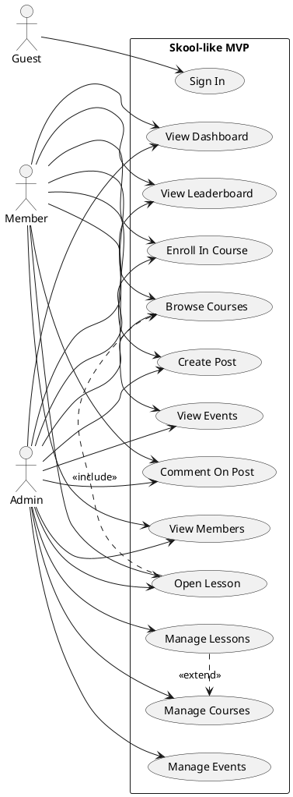
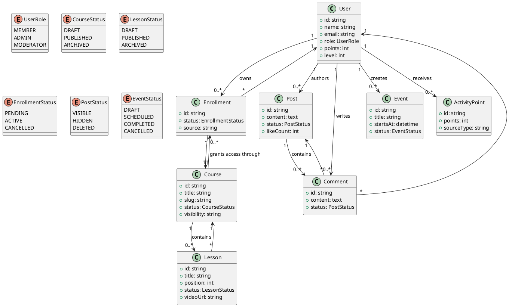
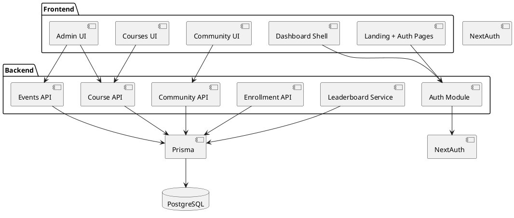
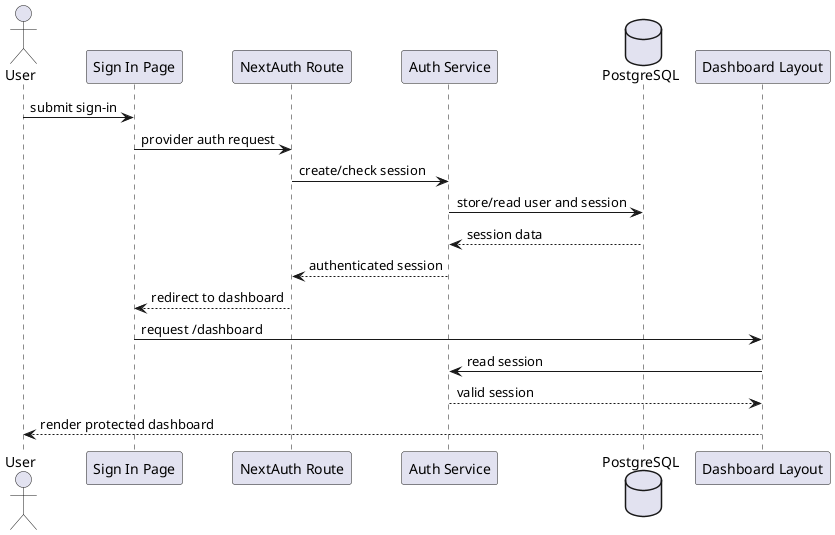
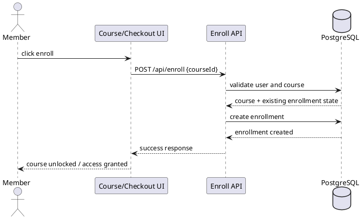
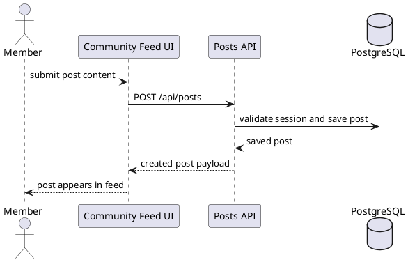
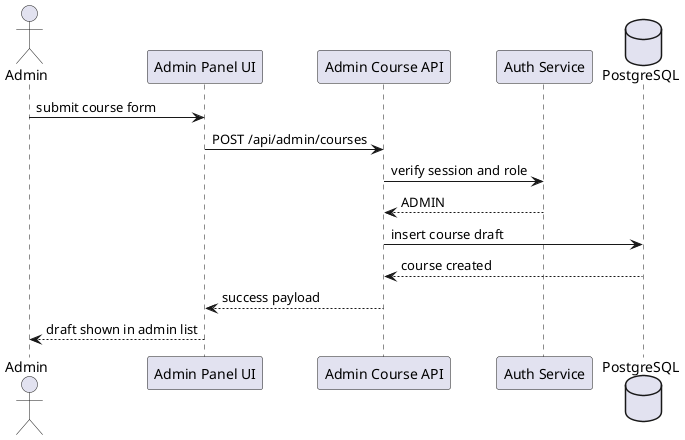
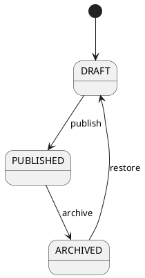
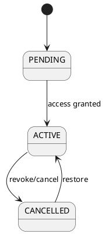
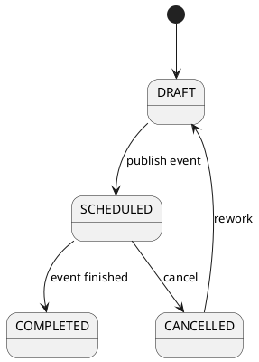

# Software Conception

Project:
- Skool-like MVP

Time box:
- 3 months
- 6 sprints of 2 weeks

Stack target:
- Next.js App Router
- TypeScript
- PostgreSQL
- Prisma
- NextAuth

Scope note:
- This document is implementation-oriented.
- It is the working conception for the MVP, not a full product specification for every future feature.
- The MVP is intentionally smaller than the real Skool product.

## 1. System Overview

The product is a community-first learning platform. One deployed instance hosts one main community space where users can:
- sign in and access protected pages
- browse courses and lessons
- join through a simplified enroll flow
- post and comment in the community feed
- view members
- see a simple events/calendar area
- gain points and levels from activity

For the MVP, the architecture stays simple:
- `Next.js` serves frontend pages and API routes
- `PostgreSQL` stores relational product data
- `Prisma` manages the schema and queries
- `NextAuth` manages sign-in and sessions

Deployment model for MVP:
- single application
- single database
- single community per deployment

This avoids premature multi-tenancy complexity.

## 2. Actors And Permissions

### Guest

Can:
- view landing page
- view sign-in page
- view public marketing content

Cannot:
- access dashboard pages
- create posts
- enroll in protected courses
- access admin actions

### Member

Can:
- access dashboard
- view accessible courses and lessons
- create posts and comments
- view members
- see events
- see own points/level

Cannot:
- manage courses
- manage users
- change system settings

### Admin

Can:
- do everything a member can
- create, update, publish, archive, and delete courses
- create lessons
- create events
- manage enroll access
- review reported content in the MVP’s simple moderation pass
- manage basic member roles

### Moderator

Optional for MVP, but model should support it later.

Can:
- review or remove posts/comments
- manage member behavior in community space

For Sprint 01, moderator UI can be deferred.

## 3. Functional Modules

### Authentication And Session

Responsibilities:
- sign in
- sign out
- protected route access
- role resolution

Core pages/routes:
- `/auth/signin`
- `/api/auth/[...nextauth]`
- route protection for `/dashboard/*`

### Dashboard Shell

Responsibilities:
- shared layout
- sidebar
- top navigation
- role-aware access entry points

### Courses

Responsibilities:
- course list
- course detail
- visibility and access rules
- search/filter

### Lessons

Responsibilities:
- lesson content page
- lesson ordering within a course
- video or rich content support

### Enrollment

Responsibilities:
- simplified enroll flow
- store access decision
- connect member to course

### Community

Responsibilities:
- posts
- comments
- likes
- activity feed sorting

### Members

Responsibilities:
- members directory
- basic profile data
- role visibility

### Events / Calendar

Responsibilities:
- event listing
- event details
- date/time display

MVP note:
- calendar can start as event list + calendar page, not full advanced scheduling.

### Leaderboard / Gamification

Responsibilities:
- track points
- compute level
- display ranking

MVP note:
- simple rules are enough; do not overbuild.

### Admin

Responsibilities:
- manage courses
- manage lessons
- manage events
- manage visibility / publication

### Review / Integration / Deployment

Responsibilities:
- branch review flow
- merge validation
- deploy checklist

## 4. Business Rules

### Access Rules

- Guests cannot access dashboard routes.
- Members can access only published and permitted content.
- Admins can access admin routes and admin APIs.

### Course Rules

- A course has many lessons.
- A lesson belongs to exactly one course.
- Only admins can create or modify courses and lessons.
- A course must have a title before publication.

### Enrollment Rules

- A member can enroll only once per course.
- Enrollment creates course access.
- MVP uses simplified enroll logic; real billing is out of scope.

### Community Rules

- Only authenticated users can create posts and comments.
- Posts belong to one author.
- Comments belong to one post and one author.
- Likes grant points.

### Leaderboard Rules

- Points increase from defined actions.
- Level is derived from points.
- Course unlock by level is optional after MVP foundation is stable.

### Event Rules

- An event has a title, start time, and owner.
- Only admins can create or update events.

### Review Rules

- No work goes to `main` before branch review.
- Sprint completion is based on validated work, not claimed work.

## 5. Main User Flows

### Flow A: Sign In And Enter Dashboard

1. Guest opens sign-in page.
2. User authenticates with NextAuth provider.
3. Session is created.
4. Protected dashboard becomes accessible.

### Flow B: Browse Course And Open Lesson

1. Member opens courses list.
2. Member selects one course.
3. System checks access.
4. Member opens lesson from lesson list.

### Flow C: Enroll In Course

1. Member opens course detail or fake checkout page.
2. Member triggers enroll action.
3. System validates course and user.
4. Enrollment record is created.
5. Course becomes accessible.

### Flow D: Create Post In Community

1. Member opens community feed.
2. Member submits a post.
3. API stores post.
4. Feed refreshes with new item.

### Flow E: Admin Creates Course

1. Admin opens admin panel.
2. Admin submits course form.
3. API validates role and payload.
4. Course draft is created.
5. Draft becomes available for later lesson management and publication.

## 6. Database Entities And Relationships

MVP design target:
- keep current auth tables
- add product entities incrementally

### Core Entities

#### User

Fields:
- `id`
- `name`
- `email`
- `image`
- `role`
- `points`
- `level`
- `createdAt`
- `updatedAt`

#### Course

Fields:
- `id`
- `title`
- `slug`
- `description`
- `status`
- `visibility`
- `thumbnailUrl`
- `createdBy`
- `createdAt`
- `updatedAt`

#### Lesson

Fields:
- `id`
- `courseId`
- `title`
- `slug`
- `description`
- `content`
- `videoUrl`
- `position`
- `status`
- `createdAt`
- `updatedAt`

#### Enrollment

Fields:
- `id`
- `userId`
- `courseId`
- `status`
- `source`
- `createdAt`

Uniqueness:
- unique `(userId, courseId)`

#### Post

Fields:
- `id`
- `authorId`
- `content`
- `status`
- `likeCount`
- `commentCount`
- `createdAt`
- `updatedAt`

#### Comment

Fields:
- `id`
- `postId`
- `authorId`
- `content`
- `status`
- `createdAt`
- `updatedAt`

#### Event

Fields:
- `id`
- `title`
- `description`
- `startsAt`
- `endsAt`
- `createdBy`
- `status`
- `createdAt`
- `updatedAt`

#### Like

Fields:
- `id`
- `userId`
- `targetType`
- `targetId`
- `createdAt`

#### ActivityPoint

Fields:
- `id`
- `userId`
- `sourceType`
- `sourceId`
- `points`
- `createdAt`

### Main Relationships

- `User 1..* Post`
- `User 1..* Comment`
- `User 1..* Enrollment`
- `User 1..* Event` as creator
- `Course 1..* Lesson`
- `Course 1..* Enrollment`
- `Post 1..* Comment`

### Status Enums To Introduce

- `CourseStatus`: `DRAFT`, `PUBLISHED`, `ARCHIVED`
- `LessonStatus`: `DRAFT`, `PUBLISHED`, `ARCHIVED`
- `EnrollmentStatus`: `PENDING`, `ACTIVE`, `CANCELLED`
- `PostStatus`: `VISIBLE`, `HIDDEN`, `DELETED`
- `EventStatus`: `DRAFT`, `SCHEDULED`, `COMPLETED`, `CANCELLED`

## 7. API Contract Proposal

Conventions:
- JSON only
- error payload format:
```json
{ "error": "message" }
```

- success payload format:
```json
{ "data": {} }
```

### Auth

- `GET|POST /api/auth/[...nextauth]`

### Courses

- `GET /api/courses`
  - query: `q`, `status`, `visibility`
- `GET /api/courses/:courseId`
- `POST /api/courses`
  - admin only
- `PATCH /api/courses/:courseId`
  - admin only
- `DELETE /api/courses/:courseId`
  - admin only

Response example:
```json
{
  "data": {
    "id": "course_1",
    "title": "Community Setup",
    "status": "DRAFT"
  }
}
```

### Lessons

- `GET /api/courses/:courseId/lessons`
- `GET /api/lessons/:lessonId`
- `POST /api/courses/:courseId/lessons`
  - admin only
- `PATCH /api/lessons/:lessonId`
  - admin only
- `DELETE /api/lessons/:lessonId`
  - admin only

### Enrollment

- `POST /api/enroll`
- `GET /api/me/enrollments`

Request example:
```json
{
  "courseId": "course_1"
}
```

### Community

- `GET /api/posts`
- `POST /api/posts`
- `GET /api/posts/:postId/comments`
- `POST /api/posts/:postId/comments`
- `POST /api/posts/:postId/like`
- `POST /api/comments/:commentId/like`

### Members

- `GET /api/users`
- `GET /api/users/:userId`

### Events

- `GET /api/events`
- `GET /api/events/:eventId`
- `POST /api/events`
  - admin only
- `PATCH /api/events/:eventId`
  - admin only

### Leaderboard

- `GET /api/leaderboard`

### Admin

- `POST /api/admin/courses`
- `DELETE /api/admin/courses`

MVP note:
- current route can be kept as compatibility route during transition
- final direction should prefer resource-style endpoints under `/api/courses`

## 8. UML Diagrams

### Use Case Diagram



### Class Diagram



### Component Diagram



### Sequence Diagram: Sign In And Access Dashboard



### Sequence Diagram: Enroll In Course



### Sequence Diagram: Create Community Post



### Sequence Diagram: Admin Creates Course



### State Diagram: Course Status



### State Diagram: Enrollment Status



### State Diagram: Event Status



## 9. Task Decomposition By Module

Goal:
- each developer should be able to move independently as much as possible
- dependencies must be explicit

### Module A: Authentication And Shell

Owner:
- P3 primary

Tasks:
- keep route protection stable
- maintain dashboard layout
- keep role-aware navigation working
- validate auth/admin access before merge

Dependencies:
- low

### Module B: Courses And Lessons

Owner:
- P1 for UI
- P2 for schema and API
- P3 for integration

P1 tasks:
- course list UI
- course detail UI
- lesson viewer UI
- loading/empty/error states

P2 tasks:
- `Course` and `Lesson` schema
- courses and lessons APIs
- stable payload contracts

P3 tasks:
- shell integration
- route protection for access pages
- review merged behavior

### Module C: Community

Owner:
- P1 for feed UI
- P2 for posts/comments API and schema
- P3 for validation/integration

P1 tasks:
- feed UI
- create post form
- comment UI

P2 tasks:
- `Post` and `Comment` schema
- posts/comments endpoints
- like support if time allows

P3 tasks:
- access protection
- branch review
- integration pass

### Module D: Enrollment

Owner:
- P1 for fake checkout UI
- P2 for enroll API
- P3 for policy integration

Tasks:
- fake checkout page
- `Enrollment` entity
- `POST /api/enroll`
- route/access checks after enrollment

### Module E: Members

Owner:
- P1 for members page UI
- P2 for members endpoint
- P3 for permissions review

Tasks:
- members page
- `GET /api/users`
- visibility rules for member data

### Module F: Events

Owner:
- P1 for events page UI
- P2 for event schema/API
- P3 for admin/event integration

Tasks:
- event list page
- event create API
- admin event management entry

### Module G: Leaderboard

Owner:
- shared, but P2 starts data model, P1 renders, P3 validates integration

Tasks:
- point rules
- leaderboard query
- leaderboard page

### Module H: Admin

Owner:
- P3 primary for admin shell and role protection
- P2 supports with real persistence

Tasks:
- admin page structure
- course creation/deletion flow
- later migration from draft/mock admin flow to DB-backed flow

### Module I: Review And Deployment

Owner:
- P3 primary

Tasks:
- branch review checks
- sprint progress validation
- deploy checklist
- final merge gate before `main`

## Recommended Delivery Order

1. Authentication + shell stability
2. Database foundation for courses, lessons, posts, comments, enrollments
3. Course and lesson UI/API
4. Community UI/API
5. Enroll flow
6. Members
7. Events
8. Leaderboard
9. Final polish and deployment

## Immediate Next Development Target

For the current state of the repo, the next practical backend target is:
- add `Course`, `Lesson`, `Enrollment`, `Post`, and `Comment` to Prisma schema

The next practical frontend target is:
- build UI pages against mock data for courses, lessons, community, and enroll flow

The next practical integration target is:
- keep auth/admin shell stable and review teammate branches as they land
